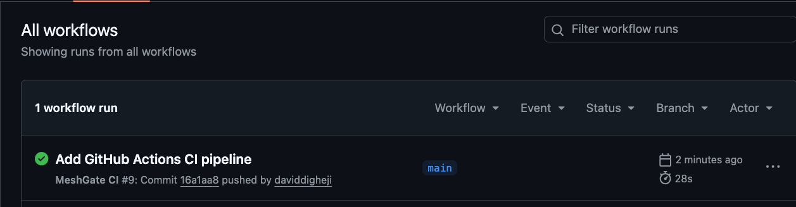
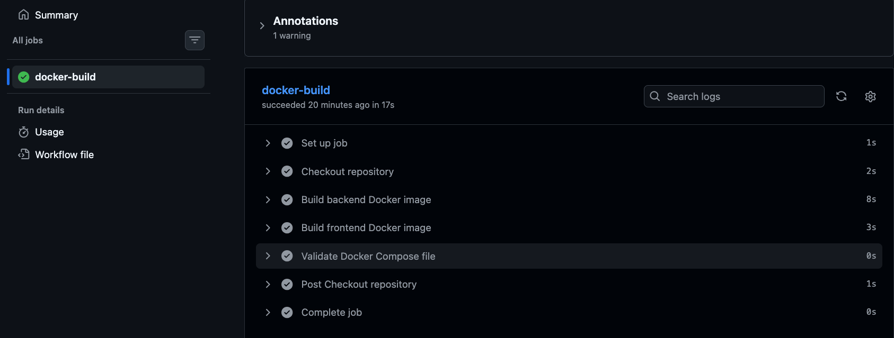

# MeshGate DevOps Platform

## Project Overview

MeshGate is a containerized full-stack application designed to demonstrate modern DevOps practices using Docker and GitHub Actions.  
The project showcases how to build, run, and automate a multi-service application with a production-style workflow.

---

##  Architecture

The application consists of:

- **Frontend**: Static web interface (served via Nginx)
- **Backend**: Python-based API service
- **Containerization**: Docker & Docker Compose
- **CI/CD**: GitHub Actions pipeline

---

## Technologies Used

- Docker  
- Docker Compose  
- GitHub Actions  
- Python (Backend)  
- HTML/CSS (Frontend)  
- Nginx  

---

##  CI/CD Pipeline (GitHub Actions)

This project includes a fully automated CI pipeline using GitHub Actions.

###  Pipeline Features

- Automatically triggers on push and pull requests to `main`
- Builds Docker images for:
  - Backend service
  - Frontend service
- Validates `docker-compose.yml` configuration
- Ensures the application is always in a deployable state

###  Pipeline Execution

####  CI Pipeline Success

####  Pipeline Steps Execution

---

##  Screenshots

###  Application Running (Frontend)

###  Backend Service Running

###  Docker Containers

---

##  Setup Instructions

---

## How to Run Locally

### 1. Clone the repository
git clone https://github.com/daviddigheji/meshgate-devops-platform.git

cd meshgate-devops-platform

### 2. Run the application
docker-compose up --build

### 3. Access the application

- Frontend: http://localhost:3000  
- Backend: http://localhost:8001  

---

## Future Improvements

- Push Docker images to registry  AWS ECR
- Add deployment stage 
- Deploy to AWS  (ECS/EC2)
- Add monitoring (CloudWatch)

---

## Author

**David Digheji**  
Cloud & DevOps Engineer
London, United Kingdom  

- GitHub: https://github.com/daviddigheji
- Portfolio: https://daviddigheji.com
- Linkedin: https://linkedin.com/in/david-digheji
---

## 💡 Key Takeaway
 
This project demonstrates practical DevOps skills including containerization, CI/CD automation, and production-level project structuring — aligned with real-world engineering practices.

