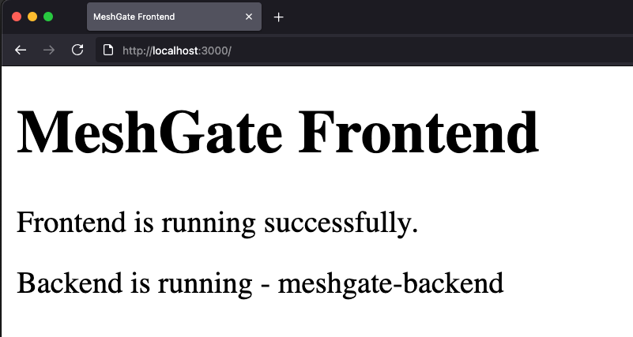
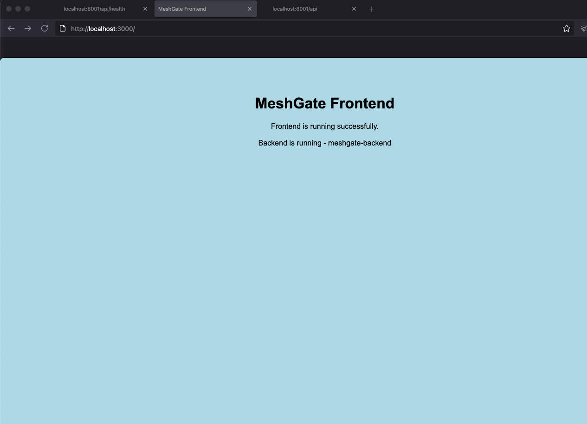

# MeshGate DevOps Platform

A hands-on DevOps project demonstrating a containerized multi-service application using Docker and Docker Compose.

## Overview

The MeshGate DevOps Platform is a hands-on project designed to simulate a real-world application environment using modern DevOps practices.

It demonstrates how frontend and backend services are containerized, orchestrated, and communicate within a Docker network.

---

**Use Case:**  
This project simulates a real-world web application where a frontend communicates with a backend API, similar to modern cloud-based microservices architectures.

---

## Tech Stack

- Docker  
- Docker Compose  
- Python (Flask)  
- NGINX (Frontend static server)  
- Linux  

---

## Architecture

Client (Browser)  
        ↓  
Frontend (NGINX container)  
        ↓  
Backend API (Flask container)  

- Frontend serves static content and interacts with backend  
- Backend processes requests and returns responses  
- Services communicate via Docker internal network  

---

## Screenshots

### Application Running


### Docker Containers


---
## Quick Start

Run the entire platform:

```bash
docker compose up --build
```

Then open:
http://localhost:3000

## Getting Started

### 1. Clone the Repository

```bash
git clone https://github.com/daviddigheji/meshgate-devops-platform.git
cd meshgate-devops-platform
```

---

### 2. Run the Application

```bash
docker compose down
docker compose up --build
```

---

### 3. Access in Browser

```
http://localhost:3000
```

---

## Key Features

* Multi-container application using Docker Compose
* Service communication via Docker network
* Clean and modular project structure
* Practical DevOps workflow (build → run → test)

---

## Documentation

[Technical Manual](docs/devops-platform-manual.md)

---

## Troubleshooting

### Containers not running

```bash
docker ps
```

If no containers are running:

```bash
docker compose up --build
```

---

### Containers exist but are stopped

```bash
docker ps -a
```

If you see "Exited":

```bash
docker rm meshgate-frontend meshgate-backend
docker compose up --build
```

---

### Container name already in use

```bash
docker compose down
docker compose up --build
```

---

### View logs

```bash
docker logs meshgate-frontend
docker logs meshgate-backend
```

---

## Key Learnings

- Gained hands-on experience with containerizing multi-service applications
- Learned how services communicate using Docker networking
- Troubleshot real-world issues such as container conflicts and port collisions
- Improved understanding of application lifecycle (build → run → debug)

## Design Decisions

- Used Docker Compose for simplicity and rapid local orchestration
- Separated frontend and backend for modularity and scalability
- Exposed only necessary ports to simulate production-like isolation

---

## Future Improvements

* Add reverse proxy (NGINX)
* Implement CI/CD pipeline (GitHub Actions)
* Deploy to AWS ECS (Fargate)
* Add monitoring and logging

---

## Author

**David Digheji**
Cloud & DevOps Engineer

david@daviddigheji.com  
https://daviddigheji.com  
https://github.com/daviddigheji
