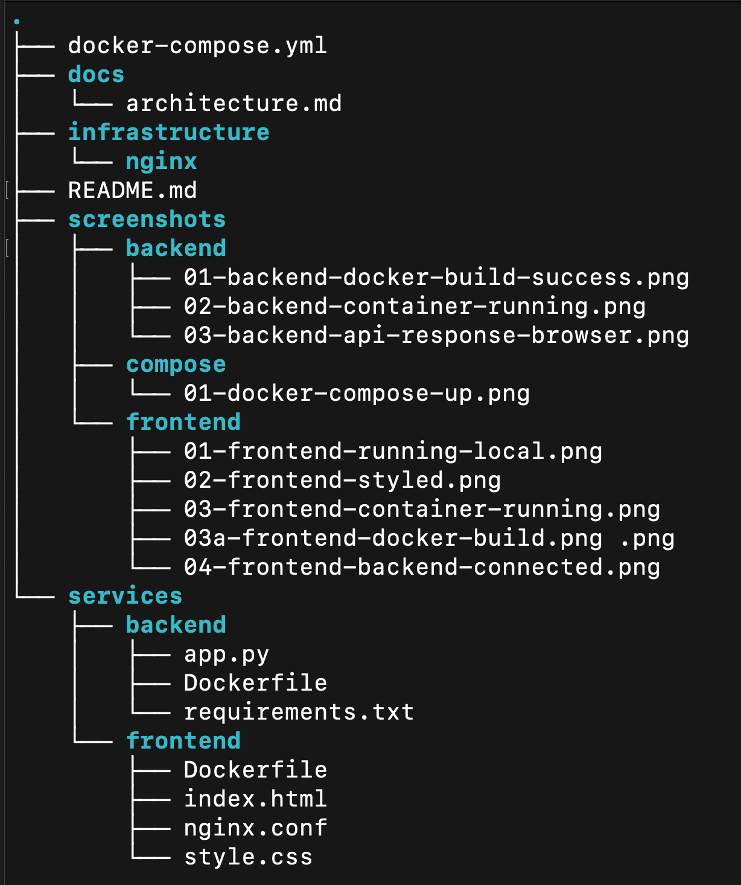

# MeshGate DevOps Platform

Production-ready DevOps platform demonstrating containerized microservices, CI/CD automation, and scalable application design.

---

## Overview

MeshGate is a DevOps-focused project that showcases how to build, containerize, and automate the deployment pipeline for a modern application using industry-standard tools.

The platform consists of a frontend and backend service, fully containerized with Docker and integrated into a CI pipeline using GitHub Actions.

---

## Architecture

This project follows a microservices-style architecture:

- Frontend service (UI)
- Backend service (API)
- Containerized using Docker
- Orchestrated locally with Docker Compose

See full details: [Architecture Overview](docs/architecture.md)

---

##  Documentation

- [Architecture Overview](docs/architecture.md)
- [CI/CD Pipeline](docs/cicd.md)

---

## Project Structure (Visual)

---

## Tech Stack

- Docker
- Docker Compose
- GitHub Actions (CI/CD)
- Python (Backend)
- HTML / CSS / JavaScript (Frontend)

---

## 🔄 CI/CD Pipeline

The project includes a CI pipeline using GitHub Actions that automatically:

- Builds the backend Docker image
- Builds the frontend Docker image
- Validates the application structure on every push to `main`

See full pipeline details: [CI/CD Pipeline](docs/cicd.md)

---

## How to Run Locally

### 1. Clone the repository
git clone https://github.com/daviddigheji/meshgate-devops-platform.git

cd meshgate-devops-platform

### 2. Run the application
docker-compose up --build

### 3. Access the application

- Frontend: http://localhost:3000  
- Backend: http://localhost:8001  

---

## Screenshots

Screenshots of the running application and CI pipeline are available in the `/screenshots` directory.

---

## Future Improvements

- Push Docker images to registry (Docker Hub / AWS ECR)
- Add deployment stage (AWS ECS or EC2)
- Implement automated testing
- Provision infrastructure using Terraform

---

## Author

**David Digheji**  
Cloud & DevOps Engineer  

- GitHub: https://github.com/daviddigheji
- Portfolio: https://daviddigheji.com

---

## 💡 Key Takeaway
 
This project demonstrates practical DevOps skills including containerization, CI/CD automation, and production-level project structuring — aligned with real-world engineering practices.

